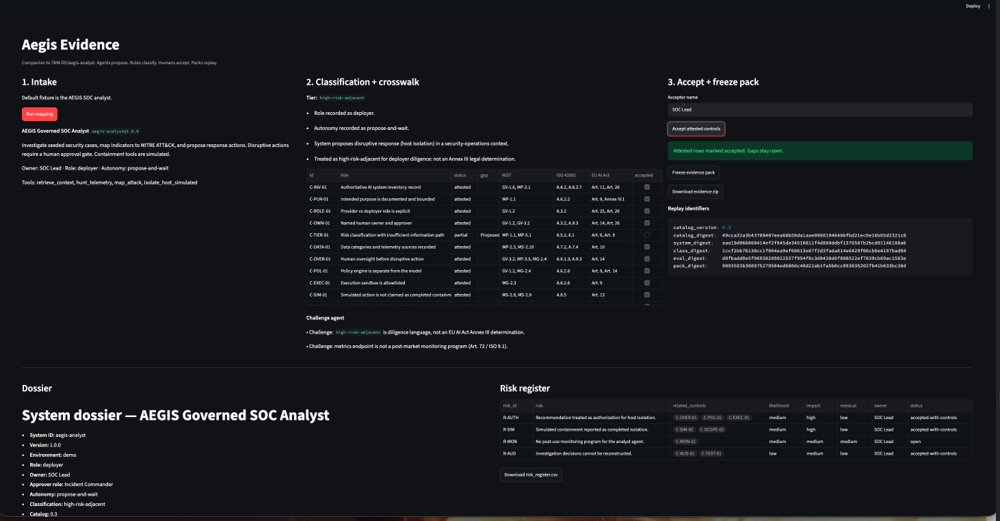
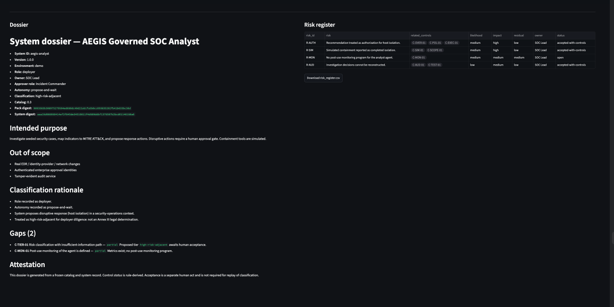

# AEGIS Evidence | Governed AI Assurance Workpaper

Companion to [TAM-DS/aegis-analyst](https://github.com/TAM-DS/aegis-analyst).

AEGIS can recommend isolating a host. This repo asks the next question: **what inspectable evidence supports its governance claims, and which gaps remain unresolved?**

> Agents propose. Rules classify. Humans accept. Packs replay.

The result is not a generated compliance policy or audit certification. It is a reproducible decision-state assessment and a separately verifiable evidence ZIP:

```
catalog + system + classification + proposed evaluations → decision-state pack_digest
complete evidence ZIP, including human acceptance + risk register → archive_sha256
```

The decision-state digest deliberately excludes human acceptance and risk-register contents, so it remains stable when a human accepts eligible declarations. The independently computed ZIP SHA-256 identifies the exact frozen artifact, including acceptance and register data. Identical inputs and acceptance state generate byte-identical ZIPs.

## See the workpaper

These are screenshots of the running console, not mockups. They were captured before the final digest and deployer-monitoring wording corrections; the current code and generated ZIP are authoritative.

**01 · Mapping** — declared controls accepted by the named operator; `C-TIER-01` stays partial; the deterministic challenge component rejects a formal Annex III classification and distinguishes deployer monitoring from provider obligations.



**02 · Workpaper** — dossier identifies the remaining classification and monitoring gaps; `R-MON` stays open. The current console shows both the decision-state digest and, after freezing, the ZIP checksum.



Same AEGIS demonstration fixture. Catalog `0.3`. The two gaps remain open even after accepting eligible declarations.

## What you get

1. **System dossier** — one page (`dossier.md`)
2. **Indicative crosswalk matrix** — NIST AI RMF / ISO 42001 / EU AI Act reference mappings and explicit gaps; these are not determinations of compliance
3. **Risk register** — CSV and JSON
4. **Evidence pack** — deterministic ZIP of the dossier, crosswalk, manifest, register, declared references, human acceptance fields, and per-file hashes
5. **Replay and verification** — decision-state digest for classification/evaluations; separate SHA-256 for the complete ZIP, including acceptance

## Architecture

```
Aegis system fixture
        |
        v
  catalog v0.3 (YAML)
        |
        v
  deterministic classifier
        |
        v
  rule engine (control status)
        |
        v
  deterministic challenge component (flags overclaims; cannot change status)
        |
        v
  human accept of attested rows
        |
        v
  deterministic ZIP + decision digest + whole-archive SHA-256
```

Classification is *high-risk-adjacent* for the AEGIS fixture. That is an internal diligence label for a SOC workflow proposing simulated isolation, **not** a legal Annex III determination or an official EU AI Act risk tier. The crosswalk is an indicative design aid, not a legal compliance assessment. For high-risk systems where the obligations apply, [Article 26(5) addresses deployer operational monitoring](https://eur-lex.europa.eu/eli/reg/2024/1689/oj), while Article 72 addresses provider post-market monitoring.

The default fixture has two deliberately open gaps: the proposed risk classification has not been formally accepted (`C-TIER-01` = `partial`), and AEGIS has an audit log but no documented deployer operational-monitoring procedure (`C-MON-01` = `partial`). The fixture does **not** claim an AEGIS metrics endpoint. An audit trail alone does not close the monitoring gap.

## Run in PyCharm

```bash
cd aegis-evidence
python3 -m venv .venv
source .venv/bin/activate   # Windows: .venv\Scripts\activate
pip install -r requirements.txt
streamlit run app.py
```

Open http://localhost:8501

1. Click **Run mapping**
2. Read the tier, crosswalk, and challenge findings
3. Click **Accept attested controls** (gaps stay open)
4. Click **Freeze evidence pack** and download the ZIP. Copy its displayed `archive_sha256`.
5. Verify the downloaded file using `shasum -a 256 <downloaded-zip>` (macOS) or `sha256sum <downloaded-zip>` (Linux). Confirm it matches `archive_sha256`.
6. Run the same mapping again. The decision-state `pack_digest` stays stable. Accepting eligible rows changes the whole-ZIP checksum, but does not falsely close partial/missing controls.

Tests:

```bash
python -m pytest tests/ -q
```

## Why this and not an audit copilot

The architecture distinguishes a declared capability from an independently verified control. The deterministic challenge component flags overclaims but cannot rewrite rule-derived statuses. A named operator can accept only `attested` or `verified` rows; missing and partial rows remain open. The complete evidence archive and its SHA-256 preserve what was actually accepted. The default fixture's declared capabilities are not independently verified enterprise controls.

## Scope

- Demonstration of deployer diligence for one governed, simulated SOC analyst agent.
- Catalog of 15 internal controls; regulatory mappings are indicative and are not a complete assessment of the EU AI Act, ISO 42001, or NIST AI RMF.
- Deterministic rules and challenge checks; no LLM required.
- No independent verification of the fixture's capability declarations, production identity/authorization, tamper-evident evidence service, or certification claim.
- All scenarios are synthetic. A successful demo does not establish legal classification, compliance, audit sufficiency, or notified-body approval.
